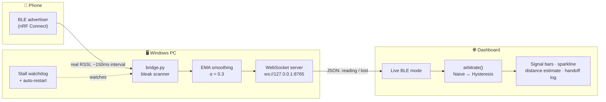
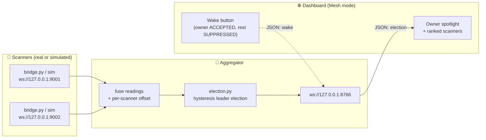
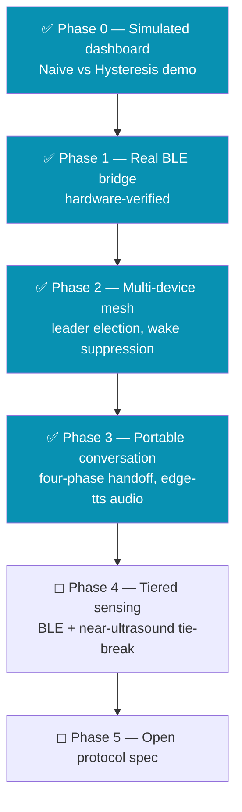

<div align="center">

# 📡 Aether Protocol

### Cross-Device AI Arbitration — without the wake-word chaos

*Say "Hey Google" near three devices and all three answer. Aether fixes that — continuously, locally, and without a cloud round-trip.*


[Quick start](#-quick-start) · [How it works](#-how-it-works) · [Why hysteresis](#-why-hysteresis-matters) · [Roadmap](#-roadmap) · [Project structure](#-project-structure)

</div>

---

## The problem

Every voice assistant on the market arbitrates devices **once, at the wake-word instant**, inside its own walled garden. There's no continuous notion of *where the user actually is* — so the closest device, the loudest device, and the "right" device are frequently three different answers.

| | Amazon (ESP) | Google | Apple | **Aether** |
|---|:---:|:---:|:---:|:---:|
| Arbitration timing | Wake-word instant | Wake-word instant | Wake-word instant | **Continuous** |
| Mid-conversation handoff | ❌ | ❌ | ❌ | ✅ |
| Cross-vendor | ❌ Echo-only | ❌ Google-only | ❌ Apple-only | ✅ Open protocol |
| Cloud dependency | Yes | Yes | Partial | **None** |

Aether's bet: treat arbitration as a **continuous, local, vendor-agnostic proximity protocol**, with the conversation itself as a portable object that hands off as the user moves through a room — like a phone call handing off between cell towers.

## 🔧 How it works



Nothing here is simulated when running in **Live BLE** mode — real radio, real signal strength, real ownership handoffs. A separate **Simulation** mode (Phase 0) reproduces the same arbitration logic with a scripted room-walk, for demoing without hardware.

## 🕸️ Multi-device mesh (Phase 2)

Phase 2 extends a single scanner into a **federated mesh**: each scanner (a real `bridge.py` instance or a hardware-free `simulated_scanner.py`) exposes its own WebSocket server, and a central `aggregator.py` connects out to each one, fuses their readings, and runs leader election on a 400 ms tick. The conversation is "owned" by exactly one scanner at a time, and ownership hands off as the user moves — exactly the cell-tower-roaming model, no cloud involved.



**The same hysteresis rule** (challenger must beat the incumbent by 5 dBm for 2 consecutive ticks) prevents flapping between scanners. A per-scanner `calibration_offset` (passed inline on the `--peers` flag) cancels radio miscalibration so a scanner that over-reports RSSI can't steal ownership from a truly-closer scanner — see the "kill-test" cases in `aether-bridge/tests/test_election.py`.

**One-click demo (no hardware):**

```
AetherMesh.bat
```

Starts two simulated scanners that walk past each other (SIM-A close → far while SIM-B far → close) plus the aggregator and dashboard, in split panes. Toggle **Source → Mesh** in the dashboard header and watch the owner spotlight hand off around the 15 s mark. See `aether-bridge/README.md` for the CLI flags and wire schema.

## 💬 Portable conversation state (Phase 3)

The conversation itself becomes a portable object. Type a message in the **Conversation** panel; the aggregator generates real speech with `edge-tts` (Microsoft neural voices, **free, no API key**) and the current owner "speaks" it. If ownership hands off mid-sentence, a four-phase contract migrates the utterance to the new owner — the assistant literally finishes its sentence on the next device.

```
User types "Hello, I am Aether"
  → owner SIM-A speaks the sentence (audio plays, sound-wave anim on SIM-A's card)

User walks → ownership hands off SIM-A → SIM-B mid-sentence
  → PREPARE (200ms) → TRANSFER (200ms, audio PAUSES at the current word)
  → CONFIRM (200ms, speaking flips to SIM-B) → RELEASE (200ms, audio RESUMES from the same word)
  → sentence continues under SIM-B — the migration is audible
```

The ~400 ms pause during TRANSFER/CONFIRM is the visceral "the sentence moved" moment. If `edge-tts` is missing or the network is down, a synthetic fallback keeps the migration demo working visually (with a "TTS offline — simulating" badge); the FSM and handoff contract are identical either way.

**Try it:** run `AetherMesh.bat`, toggle Source → Mesh, type a longish sentence (e.g. *"The quick brown fox jumps over the lazy dog"*), and watch/listen as the simulated scanners walk past each other ~15 s later.

## ⚖️ Why hysteresis matters

Raw RSSI is noisy. Naively handing ownership to "whoever has the strongest signal *right now*" causes constant flapping between devices with similar signal strength. Measured directly against this repo's dashboard, phone held stationary for 10 seconds:

```
Handoffs in 10s, phone stationary
Naive        ████████████████████████████  5   ← flaps on every noise spike
Hysteresis   ██████░░░░░░░░░░░░░░░░░░░░░░  1   ← settles, stays settled
```

Hysteresis requires a challenger to beat the active device by **5 dBm for 2 consecutive readings** before ownership changes — the same margin/consecutive-count pattern is reused for the real bridge's connection-state debounce, so a single dropped BLE packet can't flip the UI either.

```
Signal bars — getBars(rssi) mapping used throughout the dashboard
-45 dBm   ████████████████████████████████████████  5/5  ●●●●●
-60 dBm   ████████████████████████░░░░░░░░░░░░░░░░  3/5  ●●●○○
-78 dBm   ████████░░░░░░░░░░░░░░░░░░░░░░░░░░░░░░░░  1/5  ●○○○○
```

## 🚀 Quick start

**One-click (Windows, all-in-one):**

```
Aether.bat
```

Opens a single Windows Terminal window split into 3 panes (BLE bridge · dashboard dev server · free shell), and auto-opens `localhost:3000`. Falls back to separate windows if Windows Terminal isn't installed.

**Manual:**

```bash
# 1. Dashboard (simulation works with zero setup)
cd aether-dashboard
npm install
npm run dev          # -> http://localhost:3000

# 2. Real BLE bridge (optional — needs a BLE advertiser, e.g. phone + nRF Connect)
cd aether-bridge
.venv\Scripts\python.exe diag.py --mode both   # hardware gate — run this first
.venv\Scripts\python.exe bridge.py             # then the real bridge
```

Toggle **Source: Simulation → Live BLE** in the dashboard header once the bridge is running.

## 🗺️ Roadmap



| Phase | Status |
|---|---|
| 0 — Simulated dashboard | ✅ Done |
| 1 — Real BLE bridge | ✅ Code complete, hardware-verified live |
| 2 — Multi-device mesh | ✅ Build 2: aggregator + election + mesh UI, calibration wired, 24 tests green |
| 3 — Portable conversation state | ✅ Build 1: edge-tts audio, four-phase handoff FSM, conversation UI, 50 tests green |
| 4 — BLE + near-ultrasound tiered sensing | ◻ Not started |
| 5 — Open protocol spec | ◻ Not started |

## 📁 Project structure

```
Aether-BLE/
├── Aether.bat              ← one-click single-scanner demo (BLE bridge + dashboard)
├── AetherMesh.bat          ← one-click Phase 2 mesh demo (2 simulated scanners + aggregator + dashboard)
├── Aether.md               ← architecture plan, gap analysis, full roadmap
├── AETHER_SPEC.md           ← original Phase 0 AI-generation spec
├── HANDOFF.md               ← project history / research handoff notes
├── CHANGELOG.md
├── aether-dashboard/         ← Next.js + React + TypeScript, single-file UI
│   └── src/app/page.tsx      ← dashboard: simulation + Live BLE + Mesh
└── aether-bridge/            ← Python BLE scanner -> WebSocket bridge + mesh aggregator
    ├── bridge.py              ← the real-time scanner + server (Phase 1)
    ├── diag.py                ← two-part hardware diagnostic gate
    ├── aggregator.py          ← Phase 2/3 mesh aggregator + leader election + conversation FSM (serves :8766)
    ├── election.py            ← pure leader-election logic (hysteresis + tie-break)
    ├── conversation.py        ← pure conversation FSM logic (Phase 3 four-phase handoff)
    ├── simulated_scanner.py   ← hardware-free scanner for mesh demos/tests
    ├── messages.py            ← locked wire schema (reading / lost / election / conversation)
    ├── smoothing.py           ← EMA RSSI smoothing
    └── tests/                 ← pytest: election + aggregator + conversation (50 tests)
```

## 🧱 Tech stack

| Layer | Stack |
|---|---|
| Dashboard | Next.js 15 (App Router) · React 19 · TypeScript · Tailwind CSS · Framer Motion |
| Bridge | Python 3.11 · [`bleak`](https://github.com/hbldh/bleak) (BLE scanning) · `websockets` |
| Transport | Local WebSocket (`ws://127.0.0.1:8765`), JSON |

## License

Apache License 2.0 — see [LICENSE](LICENSE).
