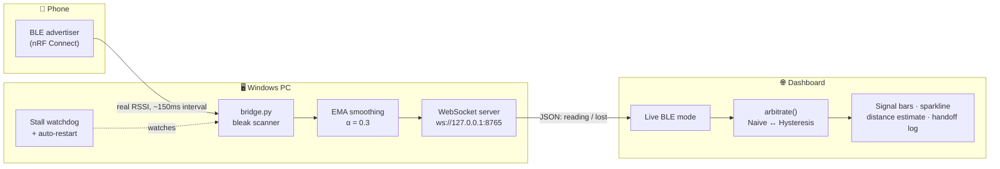
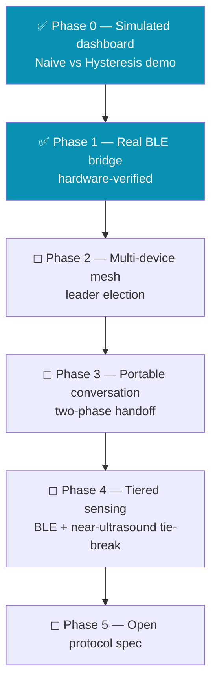

<div align="center">

# 📡 Aether Protocol

### Cross-Device AI Arbitration — without the wake-word chaos

*Say "Hey Google" near three devices and all three answer. Aether fixes that — continuously, locally, and without a cloud round-trip.*


[Quick start](#-quick-start) · [How it works](#-how-it-works) · [Why hysteresis](#-why-hysteresis-matters) · [Roadmap](#-roadmap) · [Project structure](#-project-structure)

</div>

---

## The problem

Every voice assistant on the market arbitrates devices **once, at the wake-word instant**, inside its own walled garden. There's no continuous notion of *where the user actually is* — so the closest device, the loudest device, and the "right" device are frequently three different answers.

| | Amazon (ESP) | Google | Apple | **Aether** |
|---|:---:|:---:|:---:|:---:|
| Arbitration timing | Wake-word instant | Wake-word instant | Wake-word instant | **Continuous** |
| Mid-conversation handoff | ❌ | ❌ | ❌ | ✅ |
| Cross-vendor | ❌ Echo-only | ❌ Google-only | ❌ Apple-only | ✅ Open protocol |
| Cloud dependency | Yes | Yes | Partial | **None** |

Aether's bet: treat arbitration as a **continuous, local, vendor-agnostic proximity protocol**, with the conversation itself as a portable object that hands off as the user moves through a room — like a phone call handing off between cell towers.

## 🔧 How it works



Nothing here is simulated when running in **Live BLE** mode — real radio, real signal strength, real ownership handoffs. A separate **Simulation** mode (Phase 0) reproduces the same arbitration logic with a scripted room-walk, for demoing without hardware.

## ⚖️ Why hysteresis matters

Raw RSSI is noisy. Naively handing ownership to "whoever has the strongest signal *right now*" causes constant flapping between devices with similar signal strength. Measured directly against this repo's dashboard, phone held stationary for 10 seconds:

```
Handoffs in 10s, phone stationary
Naive        ████████████████████████████  5   ← flaps on every noise spike
Hysteresis   ██████░░░░░░░░░░░░░░░░░░░░░░  1   ← settles, stays settled
```

Hysteresis requires a challenger to beat the active device by **5 dBm for 2 consecutive readings** before ownership changes — the same margin/consecutive-count pattern is reused for the real bridge's connection-state debounce, so a single dropped BLE packet can't flip the UI either.

```
Signal bars — getBars(rssi) mapping used throughout the dashboard
-45 dBm   ████████████████████████████████████████  5/5  ●●●●●
-60 dBm   ████████████████████████░░░░░░░░░░░░░░░░  3/5  ●●●○○
-78 dBm   ████████░░░░░░░░░░░░░░░░░░░░░░░░░░░░░░░░  1/5  ●○○○○
```

## 🚀 Quick start

**One-click (Windows, all-in-one):**

```
Aether.bat
```

Opens a single Windows Terminal window split into 3 panes (BLE bridge · dashboard dev server · free shell), and auto-opens `localhost:3000`. Falls back to separate windows if Windows Terminal isn't installed.

**Manual:**

```bash
# 1. Dashboard (simulation works with zero setup)
cd aether-dashboard
npm install
npm run dev          # -> http://localhost:3000

# 2. Real BLE bridge (optional — needs a BLE advertiser, e.g. phone + nRF Connect)
cd aether-bridge
.venv\Scripts\python.exe diag.py --mode both   # hardware gate — run this first
.venv\Scripts\python.exe bridge.py             # then the real bridge
```

Toggle **Source: Simulation → Live BLE** in the dashboard header once the bridge is running.

## 🗺️ Roadmap



| Phase | Status |
|---|---|
| 0 — Simulated dashboard | ✅ Done |
| 1 — Real BLE bridge | ✅ Code complete, hardware-verified live |
| 2 — Multi-device mesh | ◻ Not started |
| 3 — Portable conversation state | ◻ Not started |
| 4 — BLE + near-ultrasound tiered sensing | ◻ Not started |
| 5 — Open protocol spec | ◻ Not started |

## 📁 Project structure

```
Aether-BLE/
├── Aether.bat              ← one-click launcher (Windows Terminal, 3-pane split)
├── Aether.md               ← architecture plan, gap analysis, full roadmap
├── AETHER_SPEC.md           ← original Phase 0 AI-generation spec
├── HANDOFF.md               ← project history / research handoff notes
├── CHANGELOG.md
├── aether-dashboard/         ← Next.js + React + TypeScript, single-file UI
│   └── src/app/page.tsx      ← all dashboard logic: simulation + Live BLE
└── aether-bridge/            ← Python BLE scanner -> WebSocket bridge
    ├── diag.py                ← two-part hardware diagnostic gate
    ├── bridge.py              ← the real-time scanner + server
    └── README.md              ← bridge setup, nRF Connect checklist, troubleshooting
```

## 🧱 Tech stack

| Layer | Stack |
|---|---|
| Dashboard | Next.js 15 (App Router) · React 19 · TypeScript · Tailwind CSS · Framer Motion |
| Bridge | Python 3.11 · [`bleak`](https://github.com/hbldh/bleak) (BLE scanning) · `websockets` |
| Transport | Local WebSocket (`ws://127.0.0.1:8765`), JSON |

## License

Not yet chosen — tracked as an open item. Contributions/discussion welcome in the meantime.
